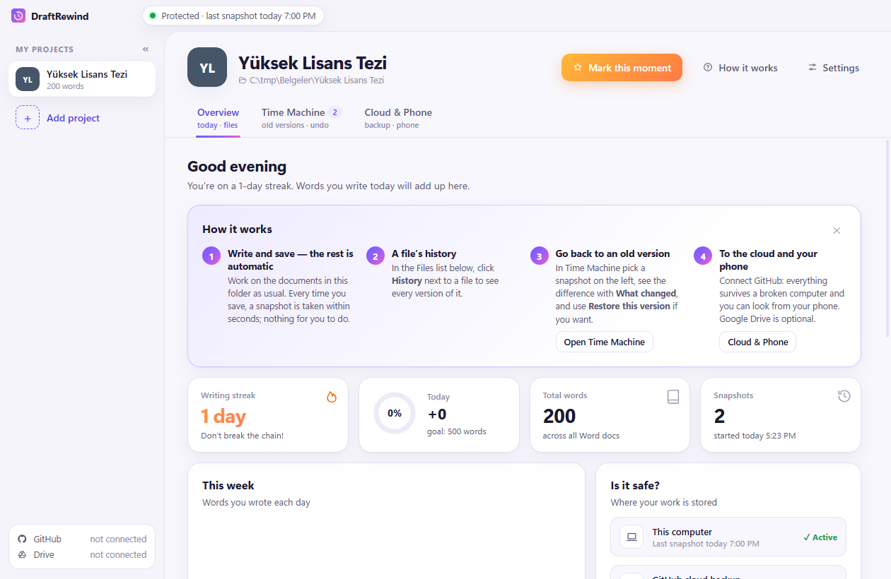
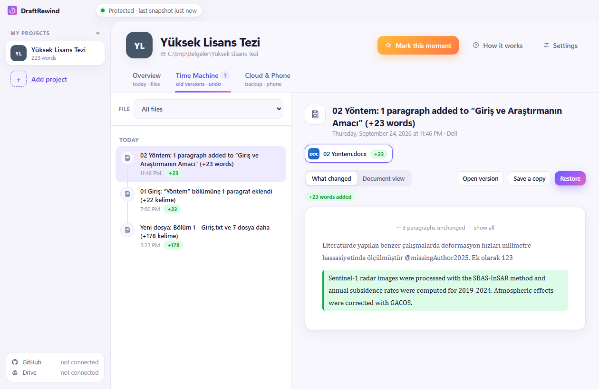
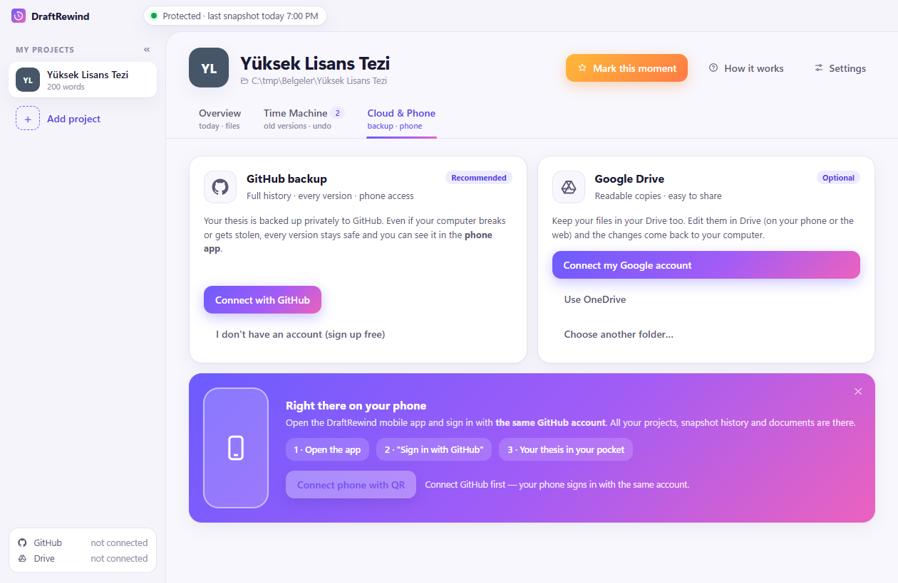
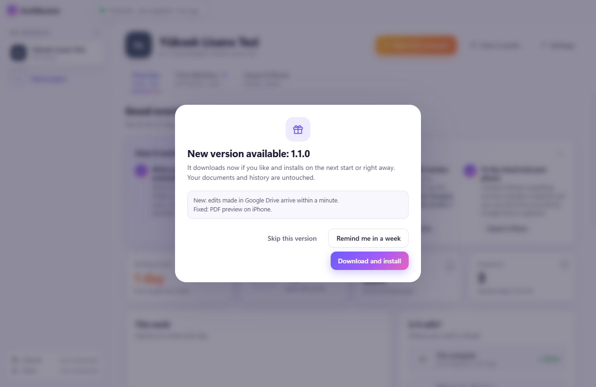

# DraftRewind

**Never lose a draft. Rewind anytime.** — *Hiçbir taslağını kaybetme, istediğin an zamanı geri sar.*

DraftRewind quietly protects the folder of your thesis, homework or paper. You write and save as usual; every save
becomes a restore point you can look at, compare and go back to. No Git, no "commit", no "push".



## What it does

- **Automatic save points** — every change becomes a restore point within seconds, with a readable title such as
  *“Methods” section: 1 paragraph added (+22 words)*, generated on your computer.
- **Unsaved-work rescue** — the unsaved contents of open Word/Excel documents are copied every few minutes (Windows).
- **Power-loss safe** — atomic writes and a journal that repairs the history after a crash.
- **Time machine** — see what changed word by word, open any older version or restore it.
- **Cloud without the hassle** — private GitHub backup and two-way Google Drive sync in the background; when two
  devices edit the same file, both versions are kept.
- **Phone app** — browse projects, history and documents, see coloured diffs, add files from your phone.
- **Optional on-device AI** — short summaries of what changed, running locally (Apple Intelligence on iPhone, a small
  local model on Windows). Nothing is sent to an AI service.

## How it looks

**Time Machine** — pick a save point, see the difference, restore with one click.



**Cloud & Phone** — connect GitHub or Google Drive once; backups run on their own.



**Updates** — the free Windows edition asks before it installs anything.



## Get it

| Platform | Official (paid, supports development) | Free |
|---|---|---|
| Windows | Microsoft Store | [GitHub Releases](https://github.com/heyobi/draftrewind/releases) (`DraftRewind-Setup-x.y.z.exe`) |
| iPhone | App Store | build from source or sideload the IPA from Releases |

The free Windows installer is not code-signed yet, so Windows SmartScreen may warn on first install.

## Build from source

```
npm install
npm start          # run the desktop app
npm run dist       # Windows installer in dist/
```

Mobile app: `mobile-expo/` (Expo SDK 57). See [CONTRIBUTING.md](CONTRIBUTING.md).

## Releasing (maintainers)

```
npm version patch                                  # bumps desktop + mobile version, commits, tags vX.Y.Z
git push origin public-main:main --follow-tags     # GitHub builds the installer, the update feed and the IPA
```

The Release workflow runs the tests, checks that the tag matches `package.json`, and attaches everything to one
GitHub Release. Edit the release notes there; the desktop app shows them in its update dialog.

## License

Code: **GNU GPL v3.0 or later** — see [LICENSE](LICENSE).
The DraftRewind name, logo and icon are trademarks and are not licensed under the GPL — see [TRADEMARKS.md](TRADEMARKS.md).
Third-party components: [THIRD_PARTY_NOTICES.md](THIRD_PARTY_NOTICES.md).

"Git" is a trademark of the Software Freedom Conservancy. DraftRewind is not affiliated with Git, GitHub or Google.
